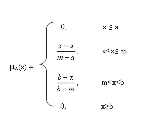
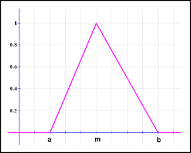
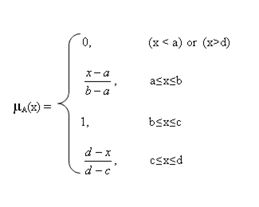
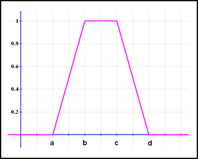

### FUZZY FRAMEWORK

#### Triangular function : defined by a lower limit a, an upper limit b, and a value m, where a < m < b.

  
  

#### Trapezoidal function: defined by a lower limit a, an upper limit d, a lower support limit b, and an upper support limit c, where a < b < c < d.

  
  

#### Remark : There are two special cases of a trapezoidal function, which are called R-functions and L-functions:

	
