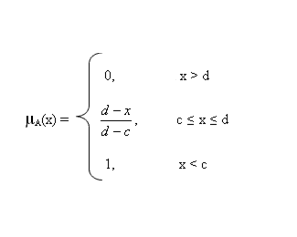
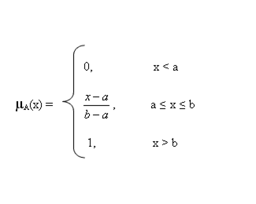
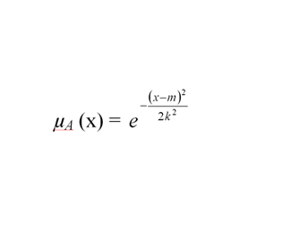
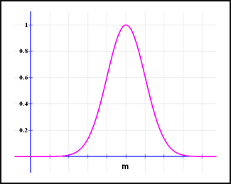

### FUZZY FRAMEWORK

	<h2>FUZZY MEMBERSHIP FUNCTIONS</h2>

	<h3>Triangular function :</h3>
	<h5>Defined by a lower limit a, an upper limit b, and a value m, where a < m < b</h5>

	

	  
	  
	

	<h3>Trapezoidal function :</h3>
	<h5>Defined by a lower limit a, an upper limit d, a lower support limit b, and an upper support limit c, where a < b < c < d</h5>

	

	  
	  
	

	<h3>Trapezoidal function remark :</h3>
	<h5>There are two special cases of a trapezoidal function, which are called R-functions and L-functions:</h5>

	<ul>
		<li>
			<h5>R-functions: with parameters a = b = - ∞ </h5>
			

				

				  
				  
				

			

		</li>
		<li>
			<h5>L-Functions: with parameters c = d = + ∞ </h5>
			

				

				  
				  
				

			

		</li>
	</ul>

	<h3>Gaussian function:</h3>
	<h5>Defined by a central value m and a standard deviation k > 0. The smaller k is, the narrower the “bell” is.</h5>

	

		
	  	
	

	<h5>For more informations about fuzzy mumbership functions </h5><a href="http://www.dma.fi.upm.es/recursos/aplicaciones/logica_borrosa/web/fuzzy_inferencia/funpert_en.htm">visit</a>

	<h2>FUZZY OPERATORS</h2>

	
