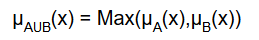
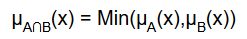
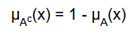

	<h1>FUZZY FRAMEWORK</h1>

	<h2>FUZZY MEMBERSHIP FUNCTIONS</h2>

	<h3>Triangular function :</h3>
	<h5>Defined by a lower limit a, an upper limit b, and a value m, where a < m < b</h5>

	

	  
	  
	

	<h3>Trapezoidal function :</h3>
	<h5>Defined by a lower limit a, an upper limit d, a lower support limit b, and an upper support limit c, where a < b < c < d</h5>

	

	  
	  
	

	<h3>Trapezoidal function remark :</h3>
	<h5>There are two special cases of a trapezoidal function, which are called R-functions and L-functions:</h5>

	<ul>
		<li>
			<h5>R-functions: with parameters a = b = - ∞ </h5>
			

				

				  
				  
				

			

		</li>
		<li>
			<h5>L-Functions: with parameters c = d = + ∞ </h5>
			

				

				  
				  
				

			

		</li>
	</ul>

	<h3>Gaussian function:</h3>
	<h5>Defined by a central value m and a standard deviation k > 0. The smaller k is, the narrower the “bell” is.</h5>

	

		
	  	
	

	<h5>For more informations about fuzzy mumbership functions </h5>
	<a href="http://www.dma.fi.upm.es/recursos/aplicaciones/logica_borrosa/web/fuzzy_inferencia/funpert_en.htm">visit</a>

	<h2>FUZZY OPERATORS</h2>

	<h3>Basic operators :</h3>
	<h5>As in classical logic, in fuzzy logic there are three basic operations on fuzzy sets: union, intersection and complement.</h5>

	<ul>
		<li>
			<h4>Union : </h4>
			<h5>Let µA and µB be membership functions that define the fuzzy sets A and B, respectively, on the universe X.</h5>
			<h5>The union of fuzzy sets A and B is a fuzzy set defined by the membership function:</h5>
			

				

					
				

			

		</li>
		<li>
			<h4>Intersection : </h4>
			<h5>Let µA and µB be membership functions that define the fuzzy sets A y B, respectively, on the universe X.</h5>
			<h5>The intersection of fuzzy sets A and B is a fuzzy set defined by the membership function:</h5>
			

				

					
				

			

		</li>
		<li>
			<h4>Complement : </h4>
			<h5>Let µA be a membership function that defines the fuzzy set A, on the universe X.</h5>
			<h5>The complement of A is a fuzzy set defined by the membership function:</h5>
			

				

					
				

			

		</li>
	</ul>

