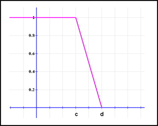
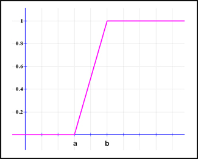

### FUZZY FRAMEWORK

	<h3>Triangular function :</h3>
	<h5>defined by a lower limit a, an upper limit b, and a value m, where a < m < b</h5>

	

	  
	  
	

	<h3>Trapezoidal function :</h3>
	<h5>defined by a lower limit a, an upper limit d, a lower support limit b, and an upper support limit c, where a < b < c < d</h5>

	

	  
	  
	

	<h3>Trapezoidal function remark :</h3>
	<h5>There are two special cases of a trapezoidal function, which are called R-functions and L-functions:</h5>

	<ul>
		<li>
			<h3>R-functions: with parameters a = b = - ∞ </h3>
			

				

				  
				  
				

			

		</li>
		<li>
			<h3>L-Functions: with parameters c = d = + ∞ </h3>
			

				

				  
				  
				

			

		</li>
	</ul>

	
